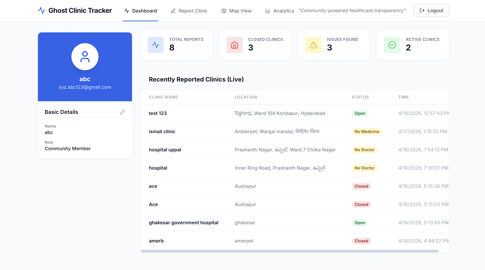
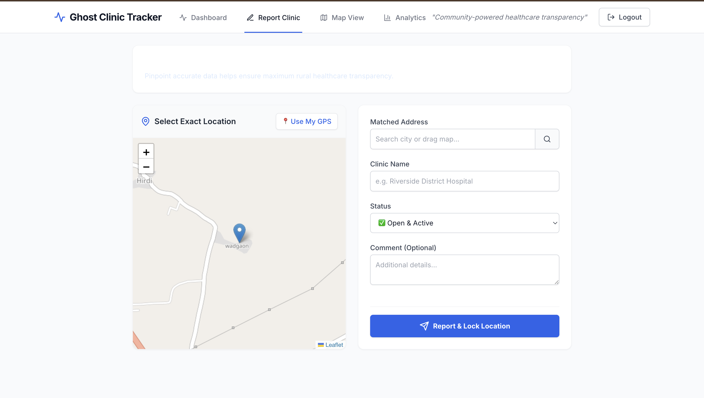
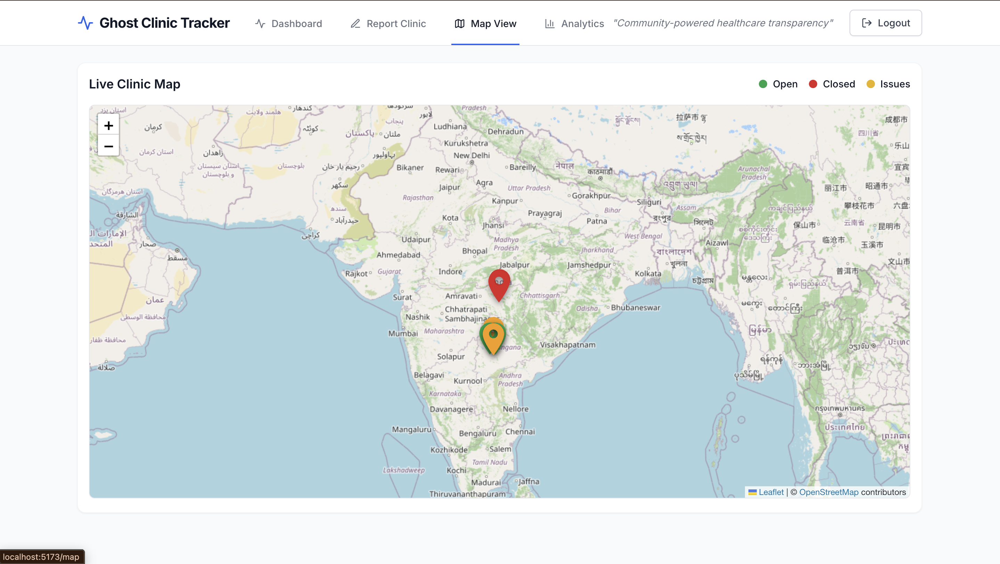
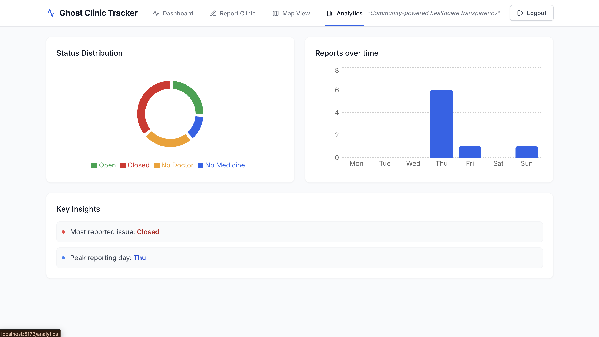

# 🏥 Ghost Clinic Tracker

**Community-powered healthcare transparency system**

Ghost Clinic Tracker is a modern web application that enables real-time monitoring of rural healthcare centres. It allows citizens to report the current status of clinics — whether they are open, closed, or facing critical issues like doctor or medicine shortages.

By making all reports publicly visible through interactive dashboards, maps, and analytics, the platform promotes transparency and accountability in rural healthcare.

---

## ✨ Features

- 📍 **Report Clinic Status** – Open, Closed, No Doctor, No Medicines
- 📊 **Real-time Dashboard** – Live updates from the community
- 🗺️ **Interactive Map View** – Location-based markers for all clinics
- 📈 **Analytics & Insights** – Charts and visual reports
- 🔍 **Search & Filter** – Easily find specific clinics
- ⚡ **Instant Sync** – Powered by Firebase for real-time updates

---

## 🛠️ Tech Stack

**Frontend:**
- React.js
- Tailwind CSS

**Backend & Database:**
- Firebase (Firestore + Authentication)

**Others:**
- Google Maps API / Leaflet
- Chart.js / Recharts

---

## 🚀 Installation & Setup

```bash
# Clone the repository
git clone https://github.com/your-username/ghost-clinic-tracker.git

# Navigate to the project folder
cd ghost-clinic-tracker

# Install dependencies
npm install

# Start the development server
npm run dev

## 🌐 Usage

1. Open the application in your browser
2. Browse or search for a healthcare centre
3. Submit a status report (Open / Closed / No Doctor / No Medicines)
4. View real-time updates on the dashboard and map
5. Explore analytics and insights

## 🎯 Purpose

To improve transparency and accessibility in **rural healthcare** through community-driven reporting and real-time monitoring.

### How to use:

1. Create a new file in your repository root called `README.md`
2. Copy and paste the above content
3. Replace `https://github.com/your-username/ghost-clinic-tracker.git` with your actual repository URL
4. (Optional) Add screenshots or demo GIFs in a new section if you have them

Would you like me to also add a **Screenshots** section or **Demo** link placeholder? I can enhance it further if needed.

## UI









## 📌 Future Enhancements

- Mobile app version (React Native)
- GPS auto-detection for clinic location
- Offline reporting support
- Verified user system
- Admin panel for moderation

## 👥 Team

- **K. Hansini**
- **V. Nischitha**
- **Shaik Subhani**
- **B. Prashanth**

## 📄 License

This project is developed for **academic and educational purposes**.